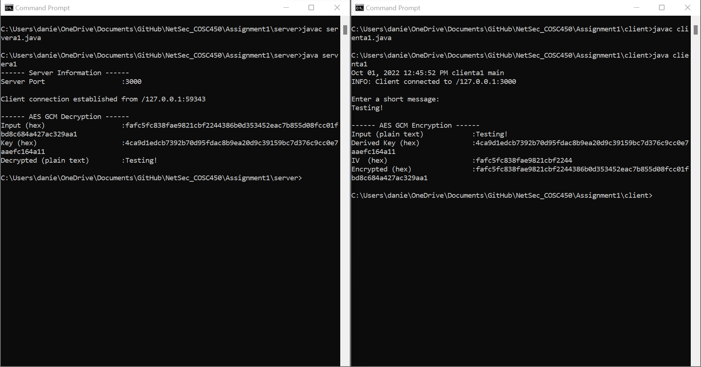

# Assignment 1

## Tutorial on how to run and test the program

1. Open two terminals

2. In the first terminal run the following commands

```console
javac servera1.java
```

```console
java servera1
```

3. In the second terminal run the following commands

```console
javac clienta1.java
```

```console
java clienta1
```

4. The Client will prompt for input type

```console
Testing!
```

5. The client's terminal will encrypt the message and print information related to the encryption
6. The server's terminal will decrypt the message and print information related to the decryption

## Indication of exact format in which a user should enter each input

This message can consist of all ASCII characters, spaces, etc. An example can be seen in the example image, but another would be the phrase "This is a secret message." There is only one opportunity for the user to enter input each time the files are run.

## Example image of the input and output when the program is run



## Method used to derive key K from S

ECDH Key Exchange - client creates key and sends it to server. The server then receives the client public key. Then the server generates a public key and sends it to client. Client and server then produce a derived key using the generated public keys recieved along with their own key pair.

Shared AES 256 bits key - Client and server produce secret keys based off the derived key generated in previous step.

AES-GCM - Client generates random 12 byte iv to use to encrypt/ decrypt message. Client encrypts plaintext using the shared secret key from previous step and iv. Client sends this message to server with the iv as a prefix. Server decrypts using secret key along with the iv. The process is completed, the plaintext has been encrypted, sent to the server, then decrypted to be returned to plaintext.
