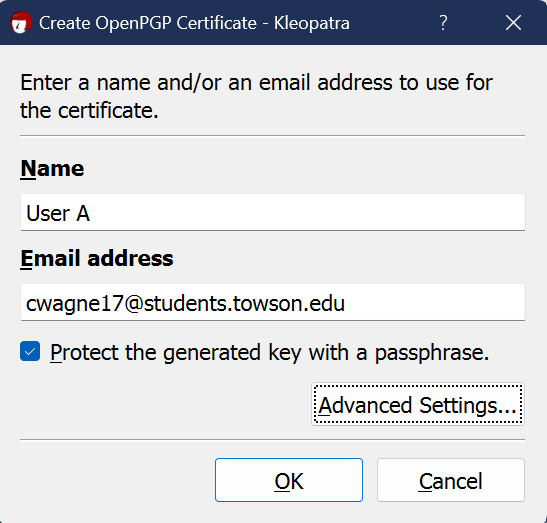
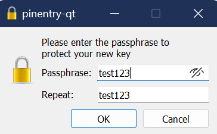
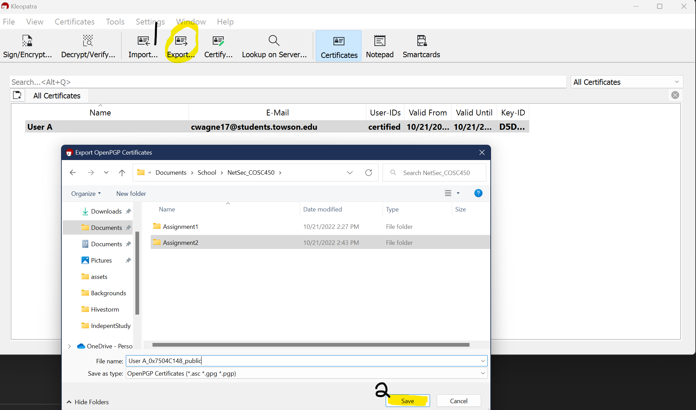
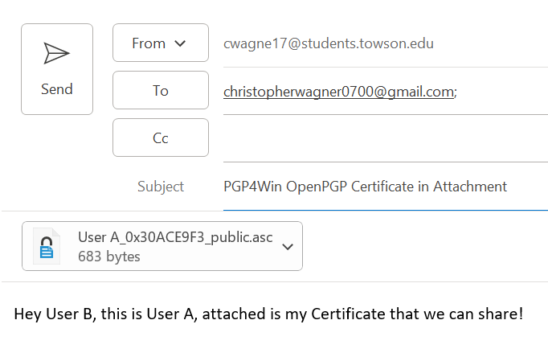
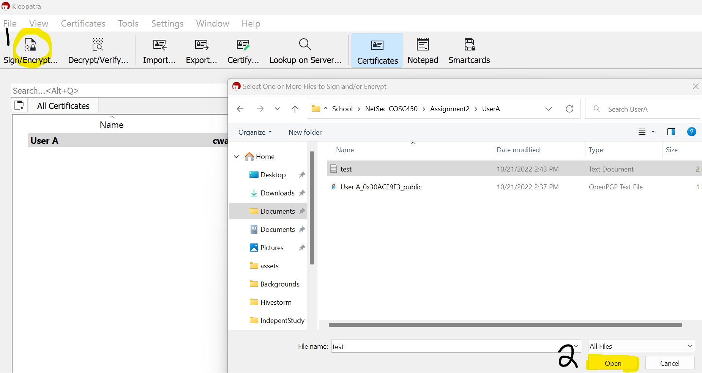
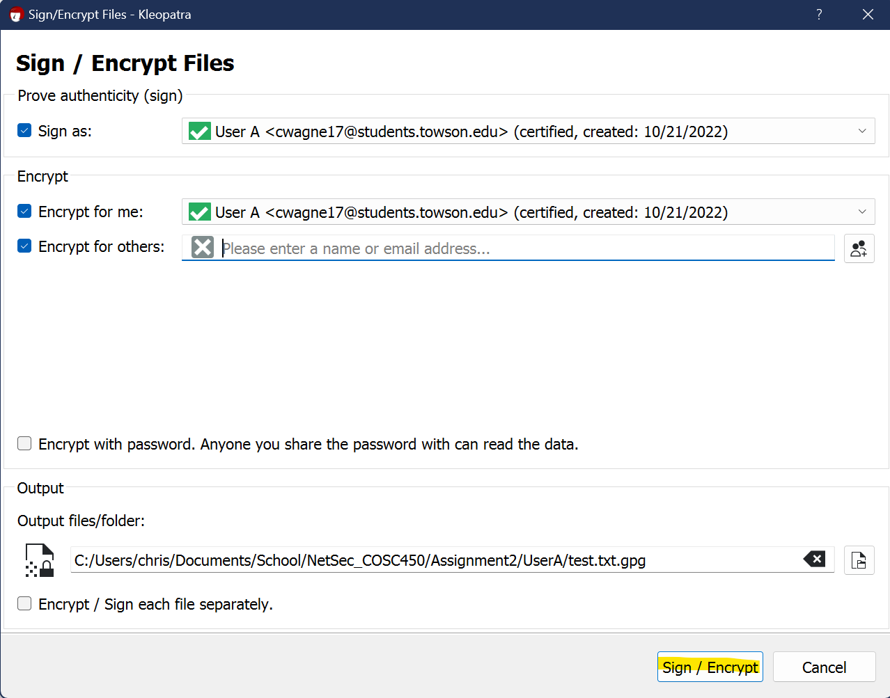
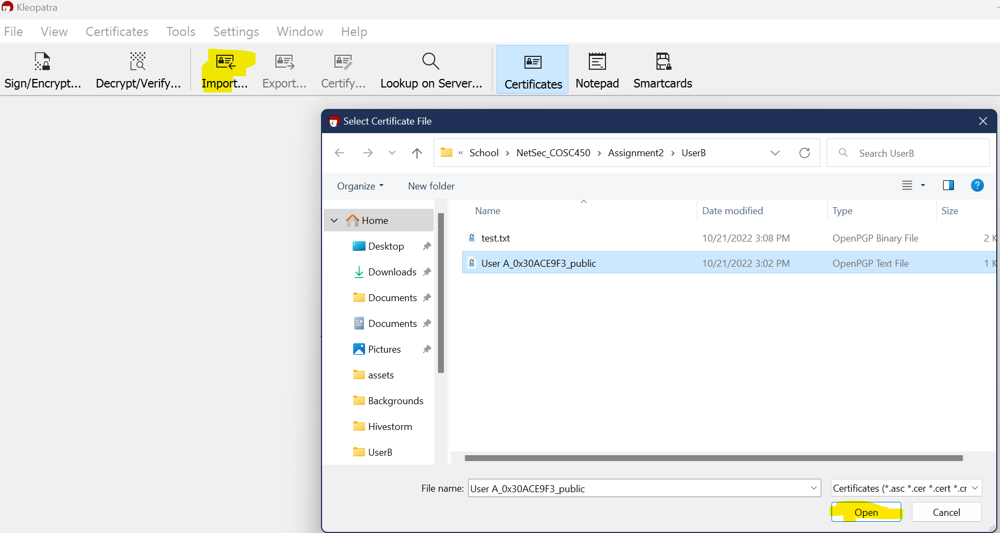
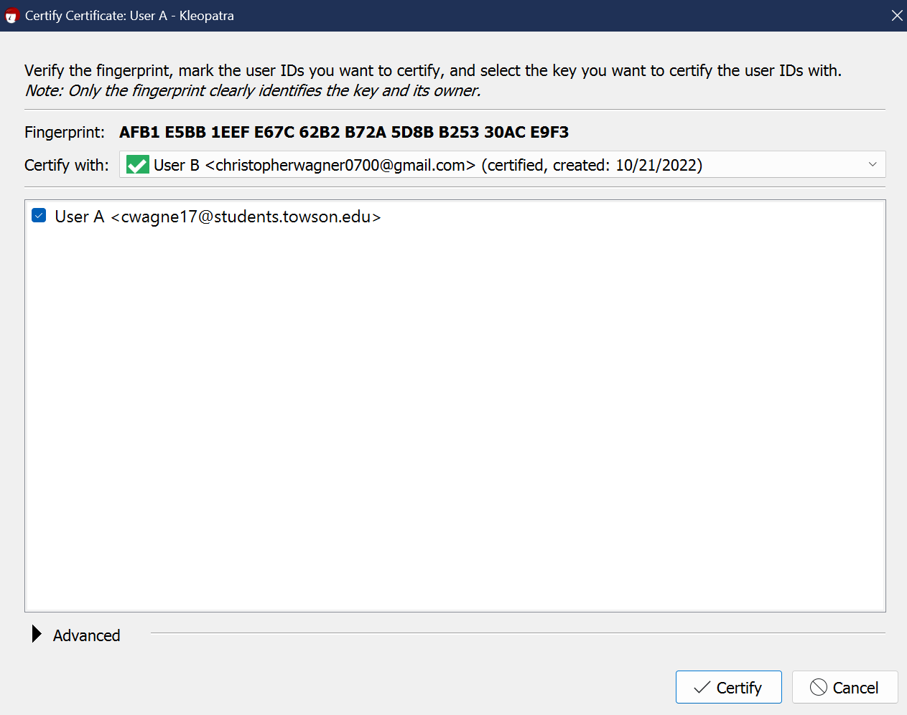
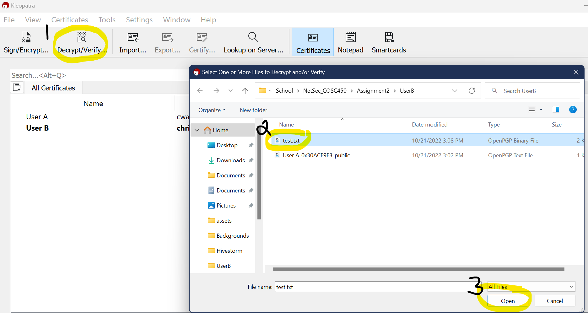
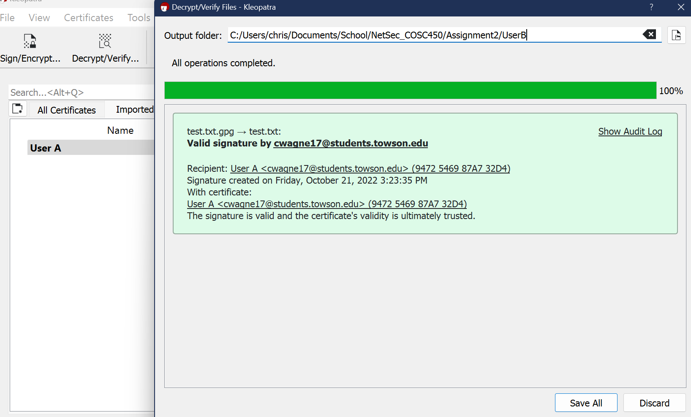

# PGP4Win

## Task 1: Use GPG4Win to set up OpenPGP certificates for 2 users A and B in your group.

In step-by-step guide, cwagne17@students.towson.edu will be associated with User A, and christopherwagner0700@gmail.com will be associated with User B.

### Open Kleopatra to create a new PGP key pair & Certificate

On UserA's machine, open Kleopatra to create a key pair.

Enter a name and email address to associate to the certificate. Optionally add a passphrase.

If adding a passphrase enter a phrase. The example uses 'test123'.

Note that 'test123' is not a strong password and Kleopatra will suggest making a stronger password before continuing.

### Exchange the public OpenPGP certificates of A and B using email.

Export the certificate from Kleopatra at the top of the dashboard and choose the file path to export the certificate to.

In an email attach te exported certificate to send to User B.

### User A uses GPG4Win to sign and encrypt a small file test.txt.

In this example a test.txt file was created with a transcript of the Gettysburg address. The content of the file is not critical to what is being accomplished in this task.

User A then encrypts the content of test.txt by highlighting their Certificate, clicking Sign/Encrypt at the top of the screen, then choosing the file path to encrypt.

A window appears after choosing the file that gives more options when signing/encrypting. The default values are sufficient. Options are available however to include names, email addresses, and passwords when encrypting.

Because a passphrase was set on the key pair, use the same passphrase to open the key pair to encrypt the test.txt file with.

The file will then be encrypted and placed in your file system as test.txt.gpg.

At this point transfer the encrypted file to UserB for them to decrypt.

### B uses GPG4Win to decrypt and verify the results.

After User B downloads both the Certificate and Encrypted file attached in emails, User A's certificate can be imported to Kleopatra.

User A's certificate will need to be verified and a way to do this is to verify that the cert is from User A is by having User B confirm it is.

For this to happen, User B must create a certificate.

Once a certificate is create, User B can verify that User A has a valid certificate. This would be done by contacting User A to authenticate. This is the basis of how peer-to-peer certifactes can have trust. X.509 on the other hand would have a trust anchor of some sort to verify them.

User B can use User A's verified certificate to Decrypt the encrypted test.txt.gpg file.

A successful message or error message will occur depending if Kleopatra was able to decrypt with User A's certificate.

In this case, we are able to successfully decrypt User A's encrypted message and retrieve the Getty's Burg Address.

